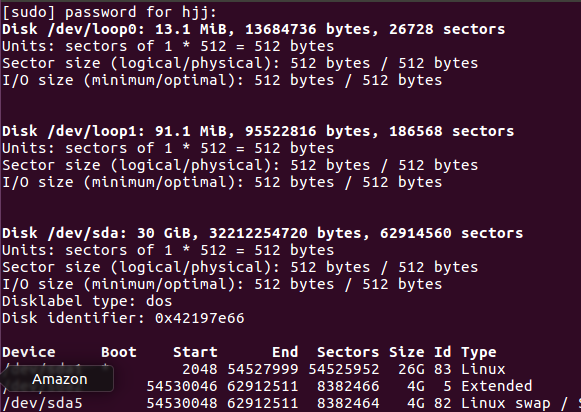
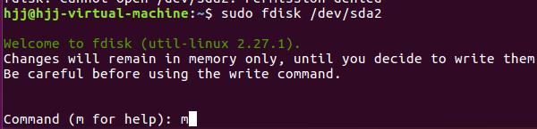
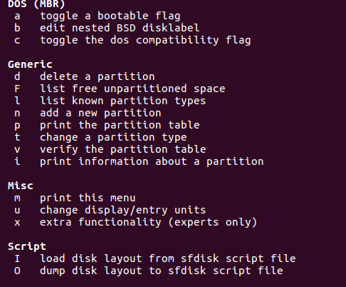
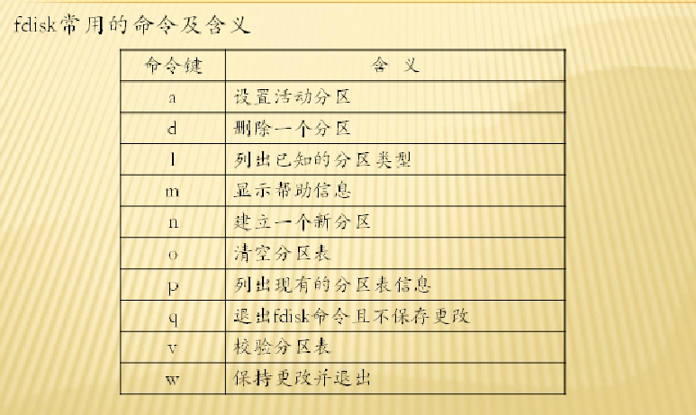
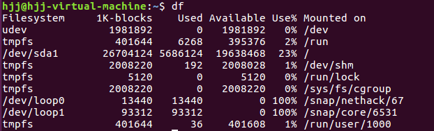
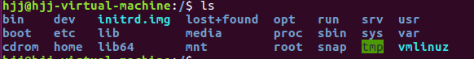

##基础命令
###1、fdisk
fdisk -l
查看磁盘分区的时候需要使用管理员权限
可以看到磁盘每个区的大小
<!-- more -->

fdisk + 设备名进去分区，也需要权限

fdisk常用命令以及含义

###2、df
df 命令：
linux中df命令的功能是用来检查linux服务器的文件系统的磁盘空间占用情况。可以利用该命令来获取硬盘被占用了多少空间，目前还剩下多少空间等信息。  
####命令格式：df [选项] [文件名]
####命令参数：df [选项] [文件名]
-a 全部文件系统列表  
-h 查看磁盘容量的使用情况  
-H 等于“-h”，但是计算式，1K=1000，而不是1K=1024  
-i 显示inode信息  
-k：以KB的容量显示各文件系统，相当于--block-size=1k。   
-m：以KB的容量显示各文件系统，相当于--block-size=1m。   
-l：--local，只显示本地文件系统。  

###3、df  
cd命令用于切换当前工作目录至 dirName(目录参数)。  

####命令格式：cd [-L|-P] [dir]  
    -P 如果要切换到的目标目录是一个符号连接，直接切换到符号连接指向的目标目录  
    -L 如果要切换到的目标目录是一个符号连接，直接切换到字符连接名代表的目录，而非符号连接所指向的目标目录  
Cd ~切换到home目录
  
cd ..返回上一层目录
  

###4、ls
ls 命令的含义是list显示当前目录中的文件名字。注意不加参数它显示除隐藏文件外的所有文件及目录的名字。
  
####文件名颜色的含义
默认色代表普通文件。		绿色代表可执行文件。  
红色代表tar包文件。		蓝色代表目录文件。            
水红代表图象文件。			青色代表链接文件。   
黄色代表设备文件。  
ps：设置显示彩色目录列表方法      
打开/etc/bashrc, 加入如下一行:alias ls="ls --color"

###5、touch
3 命令参数：

    -a  只修改文件的access(访问)时间.

    -c  或--no-create 　不创建不存在的文件。

    -d  使用指定的日期时间，而非现在的时间

    -m 指修改Modify(修改)时间,而不修改access(访问)时间

    -r  file  使用指定file文件的时间戳（access，modify）更新文件的时间戳（access，modify）