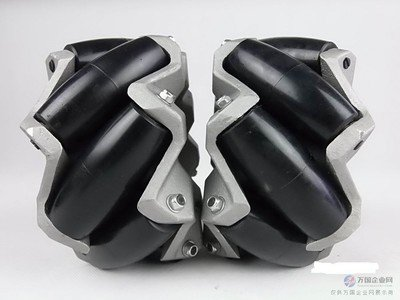
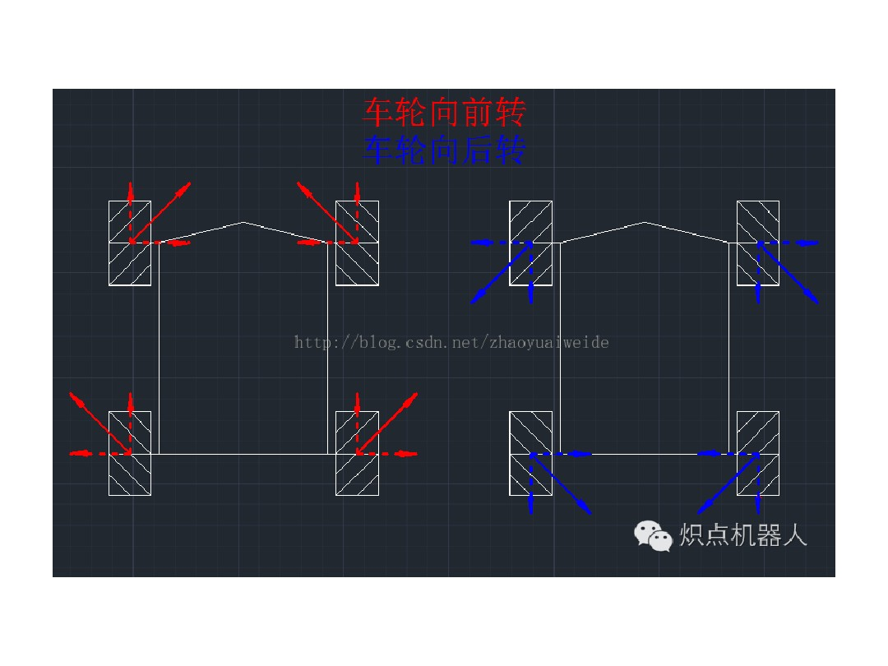
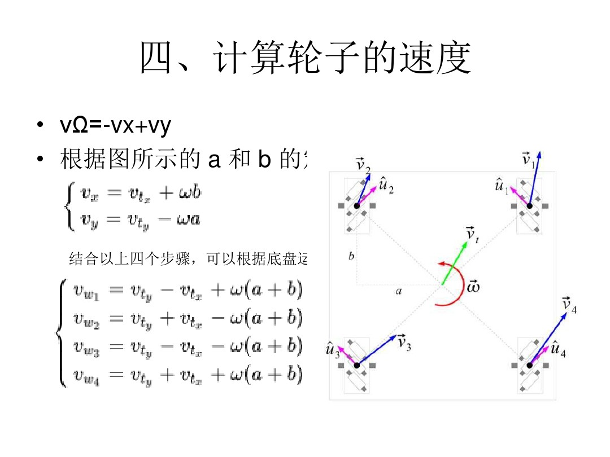

<embed src="https://player.youku.com/player.php/sid/XNDE0MDYwNzMwNA==/v.swf" quality="high" width="480" height="400" align="middle" allowScriptAccess="always" allowFullScreen="true" mode="transparent" type="application/x-shockwave-flash"></embed>

##基于stm32的搬运机器人  
###1、所需传感器。  
机械爪部分：控制爪子+转盘两个180°舵机。丝杠的步进电机。   
运动控制：麦克纳姆轮、驱动。  
其他：二维码扫描模块、颜色传感器、激光测距传感器，光电传感器。
<!---more--->
##控制
###麦克纳姆轮
麦克纳姆轮基于运动学原理。当点击前转时轮子向旋转方向45°方向收到摩擦力，四个轮子受力方向摆成菱形从而可以根据力的分解全向移动。
    
最简单是前后左右和自转，这几个运动和底盘大小没有关系，只需根据力的分解改变单个轮子的方向，而速度相同。假如斜走就需要得到底盘大小，并且根据公式分解为4个轮子的速度和方向。
。  
而我只需要前后左右基本方向，因此只需要四个方向函数，分别控制每个电机的转速与方向。
<pre><code>
void Motor_qian(u16 moa,u16 mob,u16 moc,u16 mod)
{
  TIM_SetCompare1(TIM1,moa);	//修改比较值，修改占空比
  TIM_SetCompare2(TIM1,mob);	//修改比较值，修改占空比
  TIM_SetCompare3(TIM1,moc);	//修改比较值，修改占空比
  TIM_SetCompare4(TIM1,mod-37);	//修改比较值，修改占空比
  TIM_SetCompare1(TIM8,0);	//修改比较值，修改占空比
  TIM_SetCompare2(TIM8,0);	//修改比较值，修改占空比
  TIM_SetCompare3(TIM8,0);	//修改比较值，修改占空比
  TIM_SetCompare4(TIM8,0);	//修改比较值，修改占空比
}
void Motor_hou(u16 moa,u16 mob,u16 moc,u16 mod)
{
  TIM_SetCompare1(TIM1,0);	//修改比较值，修改占空比
  TIM_SetCompare2(TIM1,0);	//修改比较值，修改占空比
  TIM_SetCompare3(TIM1,0);	//修改比较值，修改占空比
  TIM_SetCompare4(TIM1,0);	//修改比较值，修改占空比TIM_SetCompare1(TIM8,moa+37);	//修改比较值，修改占空比
  TIM_SetCompare2(TIM8,mob-37);	//修改比较值，修改占空比
  TIM_SetCompare3(TIM8,moc+37);	//修改比较值，修改占空比
  TIM_SetCompare4(TIM8,mod);	//修改比较值，修改占空比
}  </code></pre>。
采用的电机带有编码器，而驱动用的红杉伟业驱动，一路PWM波控制一个电机的一个方向，因此要电机正反转动就需要两路PWM波控制一个电机。并且一路出波形一路为零。考虑到需要8路pwm波控制四个电机，因此可采用高级定时器的互补输出功能，并配上死区（一般也可以不要）高级定时器互补输出按照说明就是设置来给电机等大功率传感器使用，死区防止转变方向时H桥烧坏。
<pre><code>
void TIMx_GPIO_Config(void)
{
  GPIO_InitTypeDef GPIO_InitStructure;
  RCC_AHB1PeriphClockCmd (RCC_AHB1Periph_GPIOC    RCC_AHB1Periph_GPIOA | RCC_AHB1Periph_GPIOB, ENABLE);
  GPIO_PinAFConfig(GPIOC,GPIO_PinSource6,GPIO_AF_TIM8);
  GPIO_PinAFConfig(GPIOA,GPIO_PinSource5,GPIO_AF_TIM8);
  GPIO_PinAFConfi (GPIOC,GPIO_PinSource7,GPIO_AF_TIM8);//第二路
  GPIO_PinAFConfig(GPIOB,GPIO_PinSource0,GPIO_AF_TIM8);
  GPIO_PinAFConfi (GPIOC,GPIO_PinSource8,GPIO_AF_TIM8);//第三路
  GPIO_PinAFConfig(GPIOB,GPIO_PinSource1,GPIO_AF_TIM8);
  GPIO_PinAFConfi (GPIOA,GPIO_PinSource8,GPIO_AF_TIM1);//第4路
  GPIO_PinAFConfig(GPIOA,GPIO_PinSource7,GPIO_AF_TIM1);
  GPIO_InitStructure.GPIO_Pin = GPIO_Pin_6 | GPIO_Pin_7 | GPIO_Pin_8;
  GPIO_InitStructure.GPIO_Mode = GPIO_Mode_AF;
  GPIO_InitStructure.GPIO_OType = GPIO_OType_PP;
  GPIO_InitStructure.GPIO_PuPd = GPIO_PuPd_NOPULL;
  GPIO_InitStructure.GPIO_Speed = GPIO_Speed_100MHz;
  GPIO_Init(GPIOC, &GPIO_InitStructure);
  GPIO_InitStructure.GPIO_Pin = GPIO_Pin_5 | GPIO_Pin_7 | GPIO_Pin_8;
  GPIO_Init(GPIOA, &GPIO_InitStructure);
  GPIO_InitStructure.GPIO_Pin = GPIO_Pin_0 | GPIO_Pin_1;
  GPIO_Init(GPIOB, &GPIO_InitStructure); 
/*  GPIO_InitTypeDef GPIO_InitStructure;
  RCC_AHB1PeriphClockCmd (RCC_AHB1Periph_GPIOC | RCC_AHB1Periph_GPIOA | RCC_AHB1Periph_GPIOE, ENABLE);
  GPIO_PinAFConfig(GPIOC,GPIO_PinSource6,GPIO_AF_TIM8);
  GPIO_PinAFConfig(GPIOC,GPIO_PinSource7,GPIO_AF_TIM8);
  GPIO_PinAFConfig(GPIOC,GPIO_PinSource8,GPIO_AF_TIM8);
  GPIO_PinAFConfig(GPIOC,GPIO_PinSource9,GPIO_AF_TIM8);
  GPIO_PinAFConfig(GPIOA,GPIO_PinSource8,GPIO_AF_TIM1);
  GPIO_PinAFConfig(GPIOA,GPIO_PinSource9,GPIO_AF_TIM1);
  GPIO_PinAFConfig(GPIOA,GPIO_PinSource10,GPIO_AF_TIM1);
  GPIO_PinAFConfig(GPIOA,GPIO_PinSource11,GPIO_AF_TIM1);
  GPIO_InitStructure.GPIO_Pin = GPIO_Pin_6 | GPIO_Pin_7 | GPIO_Pin_8 | GPIO_Pin_9;
  GPIO_InitStructure.GPIO_Mode = GPIO_Mode_AF;
  GPIO_InitStructure.GPIO_OType = GPIO_OType_PP;
  GPIO_InitStructure.GPIO_PuPd = GPIO_PuPd_NOPULL;
  GPIO_InitStructure.GPIO_Speed = GPIO_Speed_100MHz;
  GPIO_Init(GPIOC, &GPIO_InitStructure);
	//GPIO_InitStructure.GPIO_Pin = GPIO_Pin_9;
 // GPIO_Init(GPIOE, &GPIO_InitStructure);
  GPIO_InitStructure.GPIO_Pin = GPIO_Pin_8 | GPIO_Pin_9 | GPIO_Pin_10;
  GPIO_Init(GPIOA, &GPIO_InitStructure); */
 }
void TIM_Mode_Config(void)
 {
 TIM_TimeBaseInitTypeDef TIM_TimeBaseStructure;
 TIM_OCInitTypeDef TIM_OCInitStructure;
 TIM_BDTRInitTypeDef TIM_BDTRInitStructure;
 /* ================== ????????=================== */
  // 开启定时器时钟 TIMx_CLK,x[1,8]
 RCC_APB2PeriphClockCmd(RCC_APB2Periph_TIM8, ENABLE);
 RCC_APB2PeriphClockCmd(RCC_APB2Periph_TIM1, ENABLE);
 // 累计 TIM_Period+1 产生中断
 // 从0到1023 1024 为一个定时周期
 TIM_TimeBaseStructure.TIM_Period = 1000;
 // 时钟源 TIMxCLK = HCLK=168MHz
 // 定时器频率TIMxCLK/(TIM_Prescaler+1)=10KHz
 TIM_TimeBaseStructure.TIM_Prescaler = 21-1;
 // 计数方式
 TIM_TimeBaseStructure.TIM_ClockDivision=TIM_CKD_DIV1;
	 // 重复计数
 TIM_TimeBaseStructure.TIM_CounterMode=TIM_CounterMode_Up;
 TIM_TimeBaseStructure.TIM_RepetitionCounter=0;
 // 初始化定时器 TIMx, x[1,8]
 TIM_TimeBaseInit(TIM8, &TIM_TimeBaseStructure);
 TIM_TimeBaseInit(TIM1, &TIM_TimeBaseStructure);
 // 配置 PWM 1,
 TIM_OCInitStructure.TIM_OCMode = TIM_OCMode_PWM1;
 // 主使能输出
 TIM_OCInitStructure.TIM_OutputState = TIM_OutputState_Enable;
 // 互补使能输出
 TIM_OCInitStructure.TIM_OutputNState = TIM_OutputNState_Enable;
 // 配置比较值
 // TIM_OCInitStructure.TIM_Pulse = 100;
 // 主输出高电平有效
 TIM_OCInitStructure.TIM_OCPolarity = TIM_OCPolarity_High;
 // 互补输出高电平有效
 TIM_OCInitStructure.TIM_OCNPolarity = TIM_OCNPolarity_High;
 // 主输出在被禁止时为高电平
 TIM_OCInitStructure.TIM_OCIdleState = TIM_OCIdleState_Set;
 // 互补输出在被禁止时为低电平
 TIM_OCInitStructure.TIM_OCNIdleState = TIM_OCNIdleState_Reset;
 // 通道初始化
 TIM_OC1Init(TIM8, &TIM_OCInitStructure);
 TIM_OC2Init(TIM8, &TIM_OCInitStructure);
 TIM_OC3Init(TIM8, &TIM_OCInitStructure);
 TIM_OC1Init(TIM1, &TIM_OCInitStructure);
 // 使能通道重装在
 TIM_OC1PreloadConfig(TIM8, TIM_OCPreload_Enable);
 TIM_OC2PreloadConfig(TIM8, TIM_OCPreload_Enable);
 TIM_OC3PreloadConfig(TIM8, TIM_OCPreload_Enable);
 TIM_OC1PreloadConfig(TIM1, TIM_OCPreload_Enable);	
 TIM_BDTRInitStructure.TIM_OSSRState = TIM_OSSRState_Enable;
 TIM_BDTRInitStructure.TIM_OSSIState = TIM_OSSIState_Enable;
 TIM_BDTRInitStructure.TIM_LOCKLevel = TIM_LOCKLevel_1;
 // ??????
 TIM_BDTRInitStructure.TIM_DeadTime = 11;
 // TIM_BDTRInitStructure.TIM_Break = TIM_Break_Enable;
 // ????????,??????????,??????????
// TIM_BDTRInitStructure.TIM_BreakPolarity =        TIM_BreakPolarity_Low; 
 TIM_BDTRInitStructure.TIM_AutomaticOutput = TIM_AutomaticOutput_Enable;
 TIM_BDTRConfig(TIM8, &TIM_BDTRInitStructure);
 TIM_Cmd(TIM8, ENABLE);
 TIM_BDTRConfig(TIM1, &TIM_BDTRInitStructure);
 TIM_Cmd(TIM1, ENABLE);
 TIM_CtrlPWMOutputs(TIM8, ENABLE);
 TIM_CtrlPWMOutputs(TIM1, ENABLE);
 /*	RCC_APB2PeriphClockCmd(RCC_APB2Periph_TIM8, ENABLE);
 RCC_APB2PeriphClockCmd(RCC_APB2Periph_TIM1, ENABLE);
 // 累计 TIM_Period+1 产生中断
 // 从0到1023 1024 为一个定时周期
 TIM_TimeBaseStructure.TIM_Period = 100;
 // 时钟源 TIMxCLK = HCLK=168MHz
 // 定时器频率TIMxCLK/(TIM_Prescaler+1)=10KHz
 TIM_TimeBaseStructure.TIM_Prescaler = 168-1;
 // 计数方式
 TIM_TimeBaseStructure.TIM_ClockDivision=TIM_CKD_DIV1;
	 // 重复计数
 TIM_TimeBaseStructure.TIM_CounterMode=TIM_CounterMode_Up;
 TIM_TimeBaseStructure.TIM_RepetitionCounter=0;
 // 初始化定时器 TIMx, x[1,8]
 TIM_TimeBaseInit(TIM8, &TIM_TimeBaseStructure);
 TIM_TimeBaseInit(TIM1, &TIM_TimeBaseStructure);
 // 配置 PWM 1,
 TIM_OCInitStructure.TIM_OCMode = TIM_OCMode_PWM1;
 // 主使能输出
 TIM_OCInitStructure.TIM_OutputState = TIM_OutputState_Enable;
 // 配置比较值
 TIM_OCInitStructure.TIM_Pulse = 50;
 // 主输出高电平有效
 TIM_OCInitStructure.TIM_OCPolarity = TIM_OCPolarity_High;
 // 通道初始化
 TIM_OC4Init(TIM8, &TIM_OCInitStructure);
 TIM_OC3Init(TIM8, &TIM_OCInitStructure);
 TIM_OC2Init(TIM8, &TIM_OCInitStructure);
 TIM_OC1Init(TIM8, &TIM_OCInitStructure);
 TIM_OC1Init(TIM1, &TIM_OCInitStructure);
 TIM_OC4Init(TIM1, &TIM_OCInitStructure);
 TIM_OC3Init(TIM1, &TIM_OCInitStructure);
 TIM_OC2Init(TIM1, &TIM_OCInitStructure);
 // 使能通道重装在
 TIM_OC1PreloadConfig(TIM8, TIM_OCPreload_Enable);
 TIM_OC2PreloadConfig(TIM8, TIM_OCPreload_Enable);
 TIM_OC3PreloadConfig(TIM8, TIM_OCPreload_Enable);
 TIM_OC4PreloadConfig(TIM8, TIM_OCPreload_Enable);
 TIM_OC1PreloadConfig(TIM1, TIM_OCPreload_Enable);
 TIM_OC2PreloadConfig(TIM1, TIM_OCPreload_Enable);
 TIM_OC3PreloadConfig(TIM1, TIM_OCPreload_Enable);
 TIM_OC4PreloadConfig(TIM1, TIM_OCPreload_Enable);
 TIM_ARRPreloadConfig(TIM1,ENABLE);//ARPE使能 
 TIM_ARRPreloadConfig(TIM8,ENABLE);//ARPE使能 
 TIM_Cmd(TIM1, ENABLE);
 TIM_Cmd(TIM8, ENABLE);
 TIM_CtrlPWMOutputs(TIM8, ENABLE);
 TIM_CtrlPWMOutputs(TIM1, ENABLE);*/
 }
</code></pre>。
但是使用以后电机会有响声，老师说是因为互补输出导致H桥两边转换太快导致，因此用8路PWM实现，在初始化的时候不可将定时器1和8放在一个初始化函数中，否则有时可能会出错。比如某一路不出波形。

##实现光电寻迹  
寻迹是一个重点。光电传感器原理就是当激光扫到黑线时光被吸收返回一个电平，非黑返回另一个。根据现场场地来看，我想过三种光电摆放方式，一种以四个光电为一组成梯形摆放，与黑线水平放在黑线里。因此不止可以判断出黑线还可以判断是向那个方向偏，但是对摆放和巡线扫描精度要求比较高。  
第二种就是直接两个光电中间压两个黑线，第三种将三个光电来巡，一个压中间白，另外两个压旁边也就是我自己采用的方式。试验后效果也不错。因为一般不会有较大转弯。那么两个光电就可以实现巡线。同时车身每边对应放就可以实现后面的对线校准。
###PID  
实现巡线自动控制重要的一个运动控制方法就是PID算法闭环处理自动调节，在整个车身的控制分为速度环（内环），光电（外环）。速度环的目的就是精确控制每个电机的速度。通过编码器获得的电机转速可能和预设值不同，因此就可以通过PID调节渐渐靠近预设值.  
PID由三个重要部分组成：P（比例）I(积分)D（微分）组成。假设预期值为100，真实测量到的值为80，则还有20的偏差，为了快速减小偏差，通过比例系数乘以偏差值来弥补。偏差值可以随便设置，但是最好先判断下。比如在速度环中，偏差在于实际值与预设值间的偏差，那么为了减小这个偏差，就需要增大PWM波，但是又没有实际的关系和电机转速，。因此要提高的的是转速，就可以考虑定时器的频率周期为电机一秒转速的一个值，这样PWM就和电机转速扯上一定联系并且转速成为偏差值。而外环光电的偏差在于车身的偏移程度，即根据光电组那几个触到黑线的状态形成偏差，理想状态为中间传感器踩白，外面两个也才白偏差为零，否则根据预设方向设定偏差等级，值也是估计偏差值和比例的乘积与实际值的和能接近预设值。

<pre><code>  
uint8_t guangdian_filine(u8 zt,u8 dir)
{
	if(dir == 1 || dir ==2 )
	{
	//	printf("%u \n",zt);
		switch(zt)
		{
			case 0 : mid_err = 0;break;//直走
			case 1 : mid_err = -10;break;//直zuo
			case 3 : mid_err = -5;break;//向左偏
			case 4 : mid_err = 10;break;//向左偏
			case 6 : mid_err = 5;break;//向右偏
			case 7 : mid_err = 0;break;//向右偏			
		}
	}
	else if(dir == 3 || dir == 4)
	{
	//	printf("%u \n",zt);
		switch(zt)
		{
			case 0 : mid_err = 0;break;//直走
			case 1 : mid_err = -4;break;//zuo偏
			case 3 : mid_err = -2;break;//zuo偏
			case 4 : mid_err = 4;break;//zuo偏
			case 6 : mid_err = 2;break;//向you偏
		//	case 17 : Motor_stop();return 0;break;
   //	case 31 : Motor_stop();return 0;break;			
		}
	}
}
void calc_pid()
{
	P = mid_err;
	I =I + mid_err;
	D = mid_err - previous_error;
	PID_value = (Kp * P) + (Ki * I) + (Kd * D);
	previous_error = PID_value;
}
void motor_cont(u8 dir)
{
	u16 a,b,c,d;
	if(dir == 1)
	{
		a = MoA + PID_value;
		b = MoB + PID_value;
		c = MoC - PID_value;
		d = MoD - PID_value;
	}
	else if(dir == 2)
	{
		a = MoA - PID_value;
		b = MoB - PID_value;
		c = MoC + PID_value;
		d = MoD + PID_value;
	}
	else if(dir == 3)
	{
		a = MoA + PID_value*0.6;
		b = MoB - PID_value*0.6;
		c = MoC - PID_value*0.6;
		d = MoD + PID_value*0.6;
	}
	else if(dir == 4)
	{
		a = MoA - PID_value;
		b = MoB + PID_value;
		c = MoC + PID_value;
		d = MoD - PID_value;
	}
	if( a < 0)
		a = 0;
	if( b < 0)
		b = 0;
	if( c < 0)
		c = 0;
	if( d < 0)
		d = 0;
	if( a > 1000)
		a = 0;
	if( b > 1000)
		b = 1000;
	if( c > 1000)
		c = 1000;
	if( d > 1000)
		d = 1000;
	if(dir == 1)
		Motor_qian(a,b,c,d);
	else if(dir == 2)
		Motor_hou(a,b,c,d);
	else if(dir == 3)
		Motor_zuo(a,b,c,d);
	else if(dir == 4)
		Motor_you(a,b,c,d);
//	printf("%d %d %d %d\n",a,b,c,d);
}  
</code></pre>
I是积分，积分是积累从开始到现在的偏差，为的是更快的调节到理想状态。比如当车左偏，然后仅有一个比例调节一定值，此时还是左偏，这两个偏差的积累使得车知道没有达到预估的向右，因此再来积分调节使得车更早向右偏，而不是调节两次还向左最后冲出去。不过加了I后容易过度，直接就想右走很多，因为当扫描频率过大时I的累加值很容易就过大导致转弯过度。

