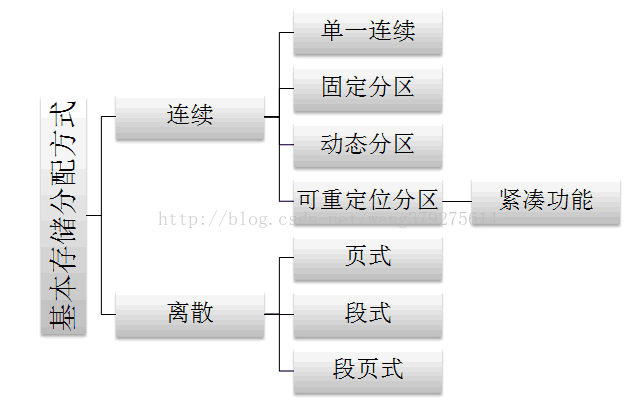

刷题库时的一些小记录

### 操作系统
1、操作系统位于硬件之上软件之下，为软件提供相应接口，使开发人员不用更操心底层的事将底层封装抽象画，只需要使用提供的接口。

2、操作系统提供给用户的接口有命令行、系统调用

3、核心态（管态）是特权态，用户态（目态）可以运行非特权指令。核心态运行于内核

4、进程控制块分为调度信息和现场信息。调度信息供进程调度时使用，描述了进程当前所处的状况、包括进程名、进程号、存储信息、优先级、当前状态、资源清单、“家族”关系、消息队列指针、进程队列指针和当前打开文件等。现场信息刻画了进程的运行情况，只记录了那些可能被其他进程改变的寄存器如状态字。

<!-- more -->

5、最佳置换算法（OPT）（理想置换算法）：从主存中移出永远不再需要的页面；如无这样的页面存在，则选择最长时间不需要访问的页面。于所选择的被淘汰页面将是以后永不使用的，或者是在最长时间内不再被访问的页面，这样可以保证获得最低的缺页率。 即被淘汰页面是以后永不使用或最长时间内不再访问的页面。因此要对未来进行预判。先进先出置换算法（FIFO）：是最简单的页面置换算法。这种算法的基本思想是：当需要淘汰一个页面时，总是选择驻留主存时间最长的页面进行淘汰，即先进入主存的页面先淘汰。其理由是：最早调入主存的页面不再被使用的可能性最大。 即优先淘汰最早进入内存的页面。 最近最久未使用（LRU）算法：这种算法的基本思想是：利用局部性原理，根据一个作业在执行过程中过去的页面访问历史来推测未来的行为。它认为过去一段时间里不曾被访问过的页面，在最近的将来可能也不会再被访问。所以，这种算法的实质是：当需要淘汰一个页面时，总是选择在最近一段时间内最久不用的页面予以淘汰。 即淘汰最近最长时间未访问过的页面。

6、

###计算机网络

